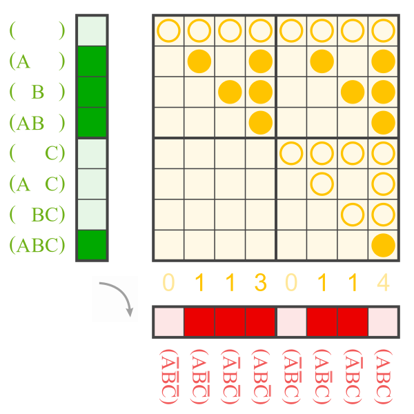

The green and the red truth tables are [Zhegalkin twins](https://en.wikiversity.org/wiki/Zhegalkin_matrix).<br>
The Sierpinski triangle rows are the results of `conju`.<br>
These rows are present for true entries in the initial truth table (green).<br>
The entries of the result (red) are the column sums of the yellow matrix modulo 2.

<a href="https://commons.wikimedia.org/wiki/File:ANF_to_0111_0110.svg">
    
</a>


The functions [using lists](functions_using_lists.py) and those [using yield](functions_using_yield.py) do essentially the same.<br>
Those using `yield` are slightly faster,
as shown in [`compare_time.py`](compare_time.py)<br>
(2.28 rather than 2.54 milliseconds for a truth table of length 256.)

```pycon
>>> from a001_misc.b003_zhegalkin_gen.functions_using_yield import zhegalkin_twin
>>> from a001_misc.b003_zhegalkin_gen.green_red import g3 as green, r3 as red
>>> green
[0, 1, 1, 1, 0, 0, 0, 1]
>>> red
[0, 1, 1, 1, 0, 1, 1, 0]
>>> list(zhegalkin_twin(3, green)) == red
True
```

----

The scripts must be run from the terminal using the m-Switch:

```
python -m a001_misc.b003_zhegalkin_gen.compare_results
python -m a001_misc.b003_zhegalkin_gen.compare_time
```

Using them without it (e.g. by clicking the run button in the IDE) would require relative imports without dots,<br>
but then importing in the console would not work anymore.

(For a simplified dots-vs-no-dots example see [`b004_relative_import`](../b004_relative_import).)
