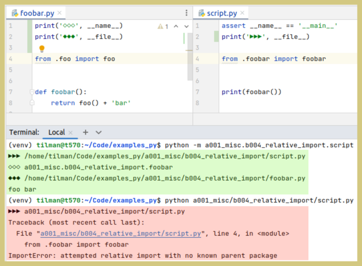
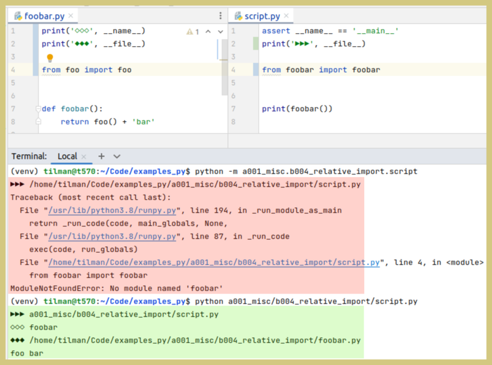

# relative import

Stackoverflow: [When to put a dot in relative imports? And what does the m-Switch have to do with it?](https://stackoverflow.com/questions/76678733)

TL;DR: Use the dots and execute script with m-Switch (and not with the button in the IDE).

Compare [`b005_absolute_import`](../b005_absolute_import).

## dots or no dots

The relative imports of `foo` if [_foobar.py_](foobar.py) and of `foobar` in [_script.py_](script.py) use dots.

But using them is not always the right choice.<br>
Depending on how the script is run, their presence can cause:<br>
`ImportError: attempted relative import with no known parent package`<br>
Or their absence can cause:<br>
`ModuleNotFoundError: No module named 'foobar'`


<table>
<tr>
<th>with dots</th>
<th>without dots</th>
</tr>
<tr>
<td></td>
<td></td>
</tr>
</table>


## with dots

### run script with m-switch

Run [script.py](script.py) from the terminal:

```
(venv) me@my:~/learn_py/examples_py$ python -m a001_misc.b004_relative_import.script
foo bar
```

### import in console

```pycon
>>> from a001_misc.b004_relative_import.foobar import foobar
>>> foobar()
'foo bar'
```

### try to run script without m-switch (fails)

```
(venv) tilman@t570:~/learn_py/examples_py$ python a001_misc/b004_relative_import/script.py 
Traceback (most recent call last):
  File "a001_misc/b004_relative_import/script.py", line 3, in <module>
    from .foobar import foobar
ImportError: attempted relative import with no known parent package
```


## after removing dots


### run script without m-switch

```
(venv) tilman@t570:~/learn_py/examples_py$ python a001_misc/b004_relative_import/script.py 
foo bar
```

### try to import in console (fails)

```pycon
from a001_misc.b004_relative_import.foobar import foobar
Traceback (most recent call last):
  File "/snap/pycharm-professional/340/plugins/python/helpers/pydev/pydevconsole.py", line 364, in runcode
    coro = func()
  File "<input>", line 1, in <module>
  File "/snap/pycharm-professional/340/plugins/python/helpers/pydev/_pydev_bundle/pydev_import_hook.py", line 21, in do_import
    module = self._system_import(name, *args, **kwargs)
  File "/home/tilman/learn_py/examples_py/a001_misc/b004_relative_import/foobar.py", line 1, in <module>
    from foo import foo
  File "/snap/pycharm-professional/340/plugins/python/helpers/pydev/_pydev_bundle/pydev_import_hook.py", line 21, in do_import
    module = self._system_import(name, *args, **kwargs)
ModuleNotFoundError: No module named 'foo'
```