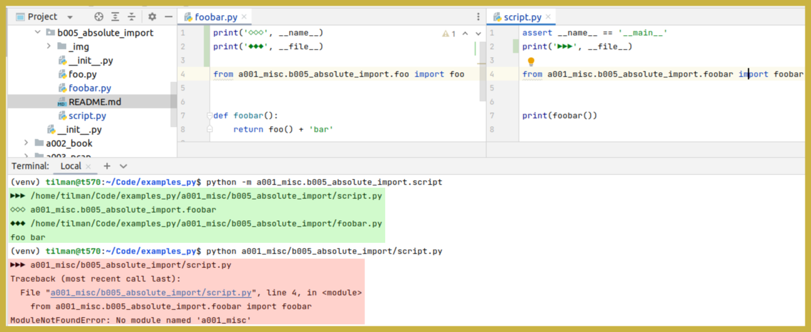

# absolute import

Compare [`b004_relative_import`](../b004_relative_import).


### run script with m-switch

```
(venv) me@my:~/learn_py/examples_py$ python -m a001_misc.b005_absolute_import.script
foo bar
```


### import in console

```pycon
from a001_misc.b005_absolute_import.foobar import foobar
foobar()
'foo bar'
```


### script without m-switch fails (unless sys-path is appended)

```
(venv) tilman@t570:~/learn_py/examples_py$ python a001_misc/b005_absolute_import/script.py
Traceback (most recent call last):
  File "a001_misc/b005_absolute_import/script.py", line 4, in <module>
    from a001_misc.b005_absolute_import.foobar import foobar
ModuleNotFoundError: No module named 'a001_misc'
```



It works after adding these lines to _script.py_:

```python
import sys
sys.path.append('/home/tilman/learn_py/examples_py')
```
