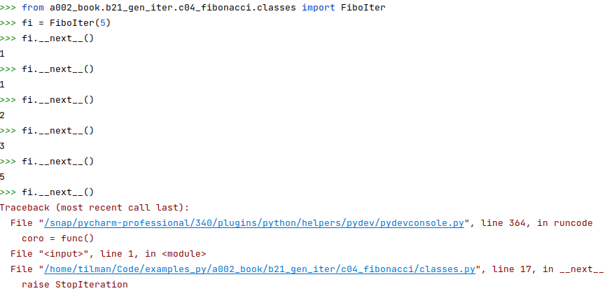

# Fibonacci

Each Fibonacci number is the sum of the two before, with the first two both equal to 1.<br>
The quotient of consecutive entries approaches 0.618 = 1/&phi; = &phi;&minus;1.

```python
from a002_book.b21_gen_iter.c04_fibonacci.classes import FiboIter, Gold, FiboYield, FiboMulti
```

This screenshot shows the use of `__next__`:


