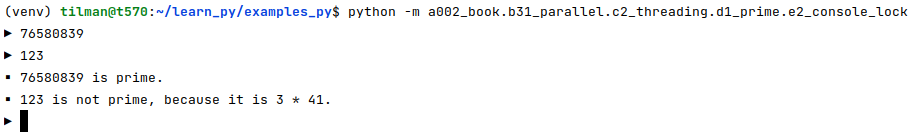

# primes

## console programs

### without lock

[e1_console.py](e1_console.py)

``` 
$ python -m a002_book.b31_parallel.c2_threading.d1_prime.e1_console
▶ 2648651225333063
▶ 126821609265383
▶ 874496478251477▪ 126821609265383 is prime.

▶ ▪ 874496478251477 is not prime, because it is 23760017 * 36805381.
▪ 2648651225333063 is not prime, because it is 51354299 * 51576037.
87701
▪ 87701 is prime.
```

### with lock

[e2_console_lock.py](e2_console_lock.py)

This version simply fails for products of primes that are not very small:

```
$ python -m a002_book.b31_parallel.c2_threading.d1_prime.e2_console_lock
▶ 4374553
▪ 4374553 is prime.
▶ 76580839
▶ 
```

4374553 (prime) sometimes works.
But 76580839 (prime) and 67898329 (2953 &middot; 22993) will fail.

The stuck result can be released by entering an easy input:



## loop instead of console

[e3_loop.py](e3_loop.py)
